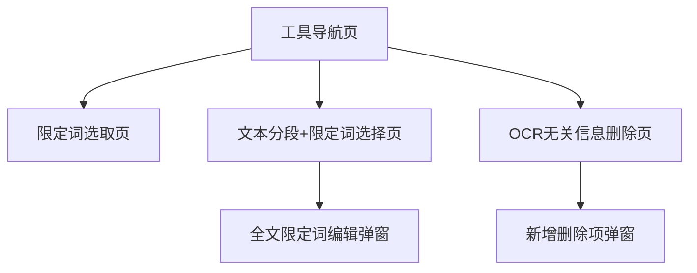

## 1. Product Overview
一个基于 Vue + Element UI 的“工具集合”页面，提供 3 个文本处理小工具并通过左侧导航切换。
当前页面存在样式分散/不一致、固定尺寸导致可读性与适配性差、信息层级弱等问题；本次目标是整体更现代、更一致、更易读。

## 2. Core Features

### 2.2 Feature Module
现有工具需求由以下页面组成：
1. **工具导航页**：侧边栏导航（展开/收起）、内容区承载、默认打开工具。
2. **限定词选取页**：文本输入、提交/清空、鼠标划取高亮、撤销/清空/复制结果。
3. **文本分段+限定词选择页**：步骤式输入、自动分段分页、划取高亮、全文限定词编辑弹窗、复制。
4. **OCR无关信息删除页**：输入文本、勾选删除项/全选、添加删除项、处理输出、复制与长度提示。

### 2.3 Page Details
| Page Name | Module Name | Feature description |
|---|---|---|
| 工具导航页 | 应用外壳布局 | 使用统一的侧边栏+内容区布局；保持页面背景、间距、圆角、阴影风格一致；内容区滚动与高度计算稳定（避免双滚动）。 |
| 工具导航页 | 导航组件 | 展示 3 个工具入口与当前选中状态；支持展开/收起；提供清晰的图标与文案对齐规则。 |
| 限定词选取页 | 输入与操作区 | 录入文本并提交/清空；提交后输入区进入只读（可见状态提示）；按钮样式与间距统一。 |
| 限定词选取页 | 文本展示与划取 | 展示提交文本；支持鼠标划取生成限定词列表；已划取内容高亮（统一高亮色与对比度）。 |
| 限定词选取页 | 结果区 | 展示“数量/总长度”；支持撤销上一次、清空全部、复制限定词结果、复制完整内容（当开启包裹模式）。 |
| 文本分段+限定词选择页 | 步骤与分页 | 按步骤输入并进入分段选择；分页控件风格统一（避免自定义按钮与 Element 风格冲突）；切页时清晰提示“已清空本页划取/全文限定词”。 |
| 文本分段+限定词选择页 | 划取与组合结果 | 在当前页文本中划取并高亮；展示“全文限定词/本页划取限定词/合并后的复制内容”三者关系与长度统计。 |
| 文本分段+限定词选择页 | 全文限定词弹窗 | 在弹窗内新增/删除/否定结构体并实时预览拼接结果；校验空输入并给出明确错误提示。 |
| OCR无关信息删除页 | 删除项管理 | 展示勾选列表与全选联动；支持新增删除项（弹窗）；默认选中项逻辑清晰可理解。 |
| OCR无关信息删除页 | 处理与输出 | 一键处理并输出；支持复制；输出长度以统一的状态色提示（超阈值显示警示）。 |

## 3. Core Process
- 导航流程：你在工具导航页通过侧边栏切换不同工具，右侧内容区展示对应工具页面。
- 限定词选取：你输入文本并提交 → 在展示区划取词组 → 在结果区撤销/清空/复制。
- 文本分段+限定词选择：你输入并提交 → 自动分段进入步骤 2 → 翻页选择当前页限定词 → （可选）编辑全文限定词 → 复制当前页或复制合并内容。
- OCR无关信息删除：你输入文本 → 勾选要删除的片段（可新增）→ 点击处理 → 复制输出并关注长度提示。

