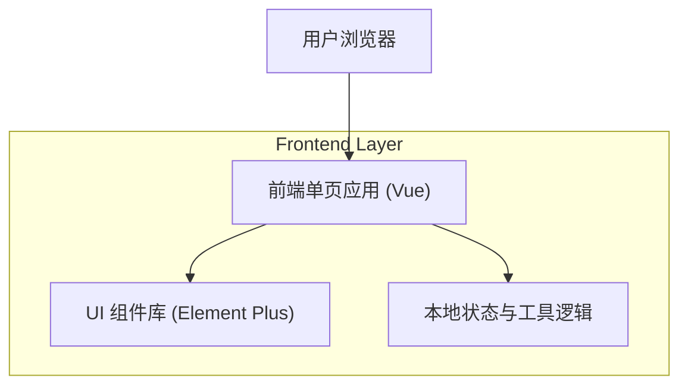

## 1.Architecture design

## 2.Technology Description
- Frontend: Vue@3 + vite + vue-router + Element Plus + CSS Variables（设计令牌）
- Backend: None

## 3.Route definitions
| Route | Purpose |
|---|---|
| / | 工具导航外壳（侧边栏 + 内容区），默认跳转到第一个工具 |
| /tools/keyword-picker | 限定词选取工具 |
| /tools/segment-picker | 文本分段+限定词选择工具 |
| /tools/ocr-cleaner | OCR无关信息删除工具 |

## 4.API definitions (If it includes backend services)
无（纯前端工具站点）。

## 6.Data model(if applicable)
无（无持久化存储需求）。

---
### UI现代化改造要点（技术方案摘要）
1. 从 iframe + 多 HTML 切换改为 SPA 路由切换，统一全局样式与状态管理，避免双滚动与样式隔离问题。
2. 抽离“按钮/输入框/卡片/提示条/分页”等基础组件样式为设计令牌（CSS Variables），禁止页面内联样式覆盖组件库默认值。
3. 将页面尺寸从固定宽高改为：内容容器 max-width + 自适应高度（min-height 与 overflow 规则统一），保证桌面端可读性与小屏可用性。
4. 将重复逻辑（复制、消息提示、文本高亮、选择集管理）封装为可复用 composables/utility，减少页面间行为不一致。